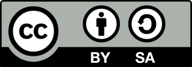

# Readme
In questo file verrà spiegato cos'è il vademecum e come poter collaborare.
Verranno elencati coloro che hanno collaborato nella realizzazione.

## È ALTAMENTE CONSIGLIATO LEGGERE PRIMA IL FILE CONTRIBUTING.MD
Contiene tutte le informazioni utili per sapere come essere utile e collaborare al progetto e le REGOLE di stile da SEGUIRE per realizzare un progetto ben fatto ed uniforme.

### Mappa file
- Cos'è
- Versione
- Come collaborare & Regole di stile
- Come viene generato il pdf finale
- Collaboratori
- Licenza

## Cos'è
Vademecum, dal latino _vade mecum_, significato letterario _vieni con me_ e figurativo _ti do una mano_ è un progetto Mozilla Italia e consiste nella realizzazione di un volantino (digitale e stampato) che permetta di capire in un foglio A4 (suddiviso in sezioni) cos'è Mozilla, Firefox e tutti i progetti correlati; l'importanza sta nel fatto che tutti questi concetti vengano espressi in pochissimo spazio e debbano essere soddisfacenti.

## Versione
L'attuale versione è la 1.2.

## Come collaborare & Regole di stile
Per sapere come contribuire/collaborare e per leggere le **regole di stile** si prega di leggere il file [_contributing.md_](https://github.com/MozillaItalia/firefox-vademecum/blob/master/contributing.md).

## Come viene generato il pdf finale
Una volta volta aggiornato correttamente il file vademecum.md si passa ad aggiornare, manualmente, anche il file HTML.
Terminato anche questo viene generato il PDF attraverso un apposito software che, partendo dal file HTML, ne genera il PDF.
La procedura di aggiornamento dell'HTML e di conversione in PDF è svolta manualmente da @Sav22999.

## Collaboratori
In questa versione i collaboratori sono (ordine A-Z):
- Cantu Niccolo
- De Rose Pasquale
- Massaro Simone
- Morelli Saverio
- Pignataro Giuseppe
- Pirrotta Irene
- Pizii Mirko
- Putti Edoardo
- Scasciafratte Daniele
- Viola Edoardo

## Licenza
La licenza utilizzata per Vademecum è la Creative Commons - Attribution (BY), ShareAlike (SA) 2.0 Italia (Attribuzione, Condivisione allo stesso modo)

Disponibile all'indirizzo https://creativecommons.org/licenses/by-sa/2.0/it/ (o quella completa https://creativecommons.org/licenses/by-sa/2.0/it/legalcode)

## Ulteriori informazioni
Coordinatore del progetto è @Mte90.